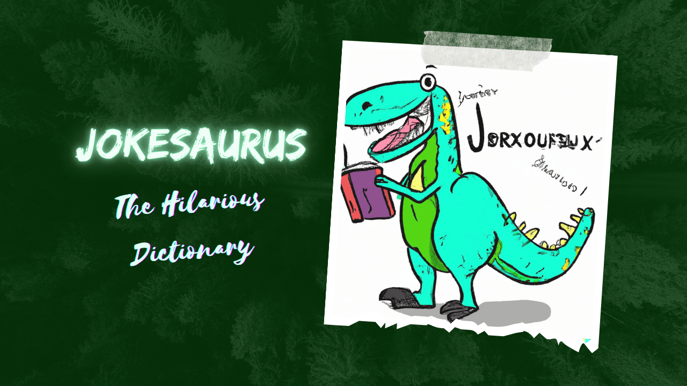

# **JokeSaurus 🦖- The Hillarious Dictionary 📚**
### *Khaby laughs Here  😂*

JokeSaurus is an exciting and laughter-filled web application developed for the **HighSchool Hacks** event organized by **Major League Hacking.** 🎉

🦖📚 Welcome to JokeSaurus, where learning meets laughter! Our project combines the functionalities of a comprehensive dictionary and a joke generator, creating a unique and engaging experience for users of all ages. 🤣

  

## Inspiration

Are you also tired of looking at those monochrome dictionaries? Well, we, "Jurassic World" while chatting got to know that we all hate that! This inspired us to make the dictionary more interesting than ever before! And then there was the birth of **JokeSaurus**!! 🦖🎉

With **JokeSaurus**, we wanted to create a dictionary that not only provides definitions but also brings joy and laughter to the learning experience. We believe that learning doesn't have to be boring, and humor is a powerful tool to engage and retain knowledge. So get ready to explore words and have a laugh with **JokeSaurus** - The Hilarious Dictionary! 😄📚

## What it does

**JokeSaurus** is not your ordinary dictionary! It combines the functionalities of a comprehensive word reference and a joke generator, creating a one-of-a-kind learning experience. Here's what **JokeSaurus** does:

* **Dictionary Lookup:** **JokeSaurus** allows you to search for any word and provides detailed information about its meaning, phonetics, and parts of speech. Expand your vocabulary and explore the fascinating world of language.
* **Hilarious Joke Generator:** Need a good laugh? **JokeSaurus** has got you covered! It generates hilarious jokes and puns related to the word you searched for. Get ready to crack up and brighten your day with some side-splitting humor.
* **User-Friendly Interface:** **JokeSaurus** features a clean and intuitive interface, making it easy to navigate and enjoy its features. Simply enter a word, click a button, and let the laughter begin!

Whether you're a language enthusiast looking to enhance your vocabulary or simply in need of a good joke, **JokeSaurus** is the perfect companion. Learn, laugh, and have a roaring good time with **JokeSaurus** - The Hilarious Dictionary! 🦖😂📚

## How we built it

Building **JokeSaurus** was an exciting and collaborative journey. Here's how we brought this fun-filled dictionary to life:

**Technologies:** We utilized a range of technologies to create **JokeSaurus**. The frontend was developed using HTML, CSS, and JavaScript, providing a responsive and interactive user interface. We leveraged the power of the W3.CSS framework for styling and layout. For the backend functionality, we used JavaScript to handle the dictionary lookup and joke generation.

**GitHub Collaboration:** GitHub played a crucial role in our development process. We leveraged its features such as projects, issues, and pull requests to manage our tasks effectively and collaborate seamlessly as a team. We embraced the power of version control and utilized branching strategies to work on different features concurrently.

**API Integration:** To enhance **JokeSaurus** with comprehensive word definitions, we integrated with a reliable dictionary API. This allowed us to retrieve accurate word information, including meanings, phonetics, and parts of speech. The API integration added depth and richness to the dictionary functionality.

**Team Collaboration:** Throughout the development process, we fostered a collaborative and supportive team environment. We regularly communicated, shared ideas, and provided feedback to create the best possible version of **JokeSaurus**. We learned from each other's expertise and grew as developers, creating a memorable experience.

## Challenges we ran into

Creating an appealing UI, optimizing joke generation, seamless API integration, and mastering GitHub actions.

Through challenges, we delivered an engaging **JokeSaurus**, with a visually appealing UI, personalized humor, and efficient functionality. Lessons learned shaped us into skilled developers.

## Accomplishments that we're proud of

Stunning UI, personalized jokes, efficient API requests, and successful GitHub adoption.

## What we learned

During the development of **JokeSaurus**, we gained valuable experiences that enhanced our skills and knowledge:

* **User-friendly UI:** Learned the importance of visually appealing and user-friendly design.
* **Optimized joke generation:** Improved relevance and personalization by including the typed word.
* **Seamless API integration:** Successfully worked with external APIs and handled requests effectively.
* **GitHub collaboration:** Explored features like actions, projects, and issue tracking for collaborative development.

## Team Collab: Embracing the Beauty of Teamwork

As beginners in the world of hacking, our **JokeSaurus** journey was filled with laughter, learning, and the power of collaboration. We discovered the beauty of working together, building connections, and leveraging each other's strengths. The experience taught us valuable lessons in teamwork, communication, and the joy of creating something fun and meaningful as a united team.

## What's next for Jokesaurus: The Hilarious Dictionary
We're taking laughter to the next level! Our plans include adding captivating animations to bring the jokes to life and incorporating examples from the dictionary API to provide context and deepen the learning experience. Get ready to laugh and learn in a whole new way! Stay tuned for more exciting updates!
